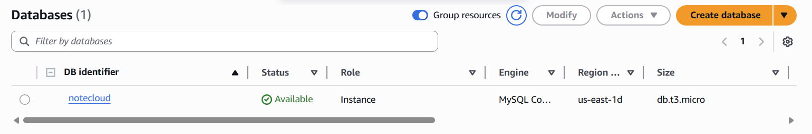
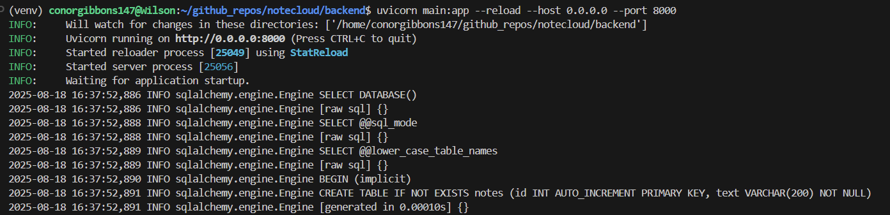
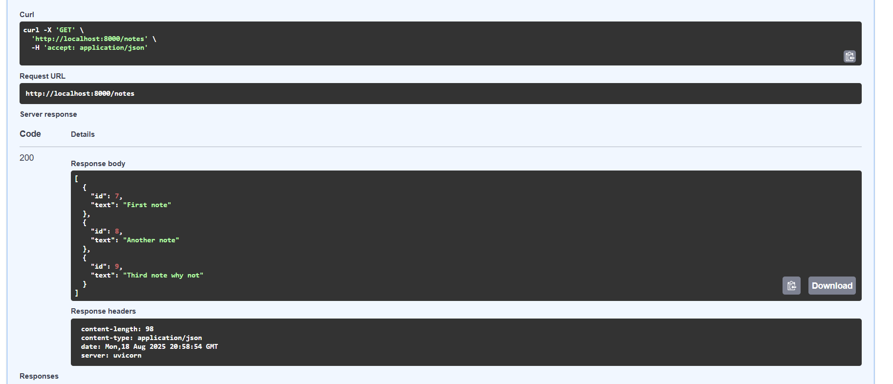
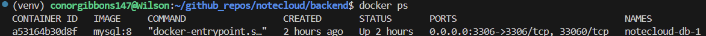

# NoteCloud

NoteCloud is a small note-taking API I built with FastAPI and MySQL, using AWS RDS to store the data. It supports creating, reading, updating, and deleting notes through simple endpoints.

The API lets you create, read, update, and delete notes. Notes are stored in a MySQL database hosted on Amazon RDS, while the FastAPI app serves as the interface to interact with them. Docker was used for local development to keep everything isolated and reproducible.

This project gave me hands-on experience in backend development, database management, and cloud integration with AWS. It strengthened my understanding of API design, working with relational databases, and deploying applications that use both local and cloud resources.

## Screenshots  

### AWS RDS Instance  
  

### FastAPI Running  
  

### Swagger UI with Notes  
  

### Docker Container Running  
  
